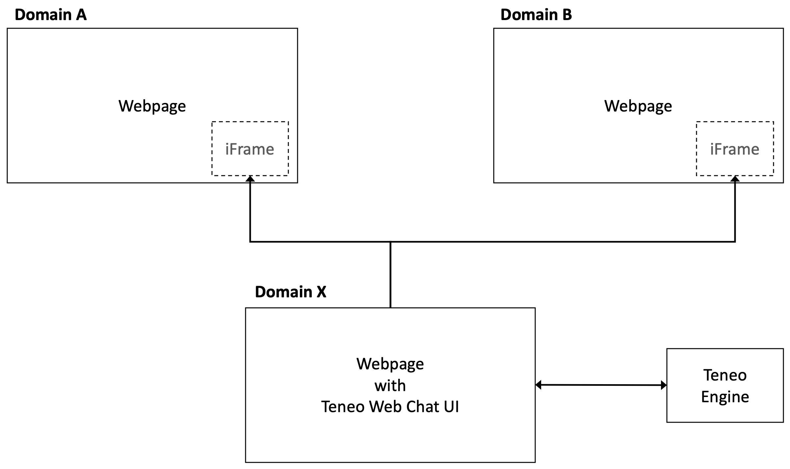

# Tenoe Web Chat cross-domain example
This repository contains example scripts that can be used to use Teneo Web Chat in a way that supports cross-domain browsing. This means users can start a conversation on website hosted on domain A, move to a website hosted on domain B and continue the conversation.

# Prerequisites and limitations
## Teneo Web Chat version
This requires Teneo Web Chat 3.1.0 or higher. You will need to add the latest version of Teneo Web Chat to the 'child' folder manually. You can find the latest version here: [https://github.com/artificialsolutions/teneo-web-chat/releases](https://github.com/artificialsolutions/teneo-web-chat/releases)

## Broswer support
Embedding Teneo Web Chat with support for cross-domain browsing is supported in all major browsers (Chrome, Firefox, Edge and IE11) except Safari when 'Prevent cross-site tracking' is enabled. It's also not supported in Chrome and Firefox on iOS. 

# How does it work
To support cross-domain browsing, a page that contains the Teneo Web Chat UI is loaded in an iFrame. This iFrame is embedded your websites (which may use different domains).

{:width="50%"}

In this repository, the 'child' folder contains the page, scripts and stylesheets that are used to display the the Teneo Web Chat UI in the iFrame.

The 'host' folder contains an example page the example code to